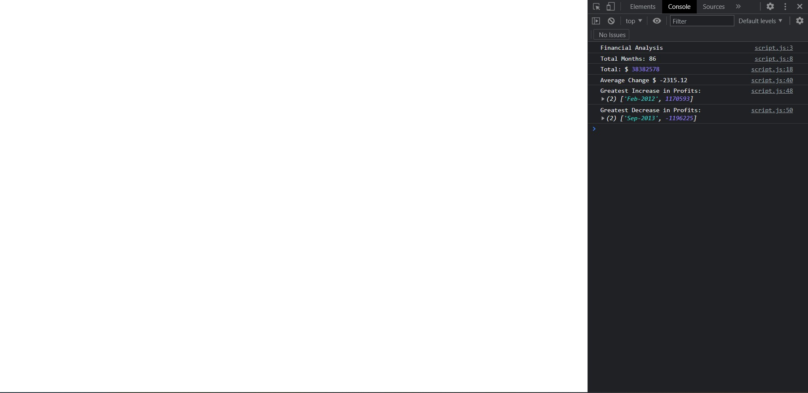

# Console Finances

## Description
 
In this application, I have used JavaScript to output a financial summary into the Console. When you open the Console, you will see: 

* The total number of months included in the financial dataset.

* The net total amount of Profit/Losses over the entire period.

* The average of the changes in Profit/Losses over the entire period.

* The greatest increase in profits (date and amount) over the entire period.

* The greatest decrease in losses (date and amount) over the entire period.

## Screenshot

## Links

Live application: 
